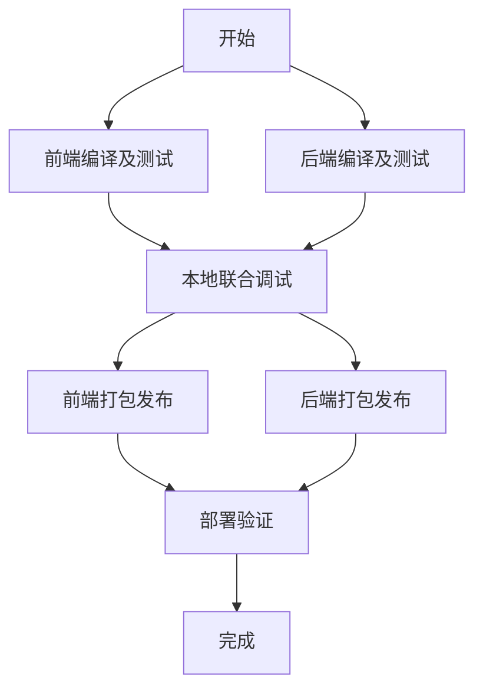

# 🔨 第三步: 编译及镜像制作

本文档介绍如何编译前端应用、后端服务并制作Docker镜像。

## 📋 前置条件

- 完成 [第二步: 基础设施搭建](../02-infrastructure-setup/README.md)
- 确保开发环境已正确配置

## ⚠️ 架构兼容性重要说明

**M4芯片用户必读**: 由于本地开发环境使用ARM64架构，而腾讯云SCF运行环境为x86-64架构，所有Go应用必须进行交叉编译。我们的脚本已自动处理此问题。

**关键技术要点**:
- 交叉编译参数: `CGO_ENABLED=0 GOOS=linux GOARCH=amd64`
- Docker镜像平台: `--platform linux/amd64`
- 自动架构验证: 确保生成的二进制文件为x86-64格式

## 📚 构建流程文档

本构建流程分为以下5个部分，请按顺序进行：

### 1️⃣ [前端编译及单元测试](./01-frontend-build-test.md)
- 前端环境准备
- 依赖安装和管理
- 代码编译和构建
- 单元测试执行
- 构建结果验证

### 2️⃣ [后端编译及单元测试](./02-backend-build-test.md)
- 后端环境准备
- Go模块依赖管理
- 交叉编译配置
- 单元测试和基准测试
- 二进制文件验证

### 3️⃣ [本地联合调试](./03-local-integration-debug.md)
- 本地开发环境搭建
- 前后端联合调试配置
- API接口测试
- 端到端测试
- 调试工具和技巧

### 4️⃣ [前端打包发布](./04-frontend-package-deploy.md)
- 生产环境构建优化
- 静态资源处理
- CDN部署准备
- 性能优化和压缩
- 部署验证

### 5️⃣ [后端打包发布](./05-backend-package-deploy.md)
- Docker镜像制作
- 容器化配置
- 镜像优化和安全
- 容器注册表推送
- 部署验证

## 🤖 快速开始（自动化脚本）

如果你想快速完成所有构建步骤，可以使用我们提供的自动化脚本：

```bash
# 完整构建流程
./scripts/03-build-and-package/build-all.sh

# 或者分步执行
./scripts/03-build-and-package/build-frontend.sh --prod
./scripts/03-build-and-package/build-backend.sh --all
./scripts/03-build-and-package/build-docker-images.sh --push
```

## 📊 构建流程图



## 🚨 常见问题

参考 [troubleshooting.md](./troubleshooting.md) 了解构建过程中的常见问题和解决方案。

## 📝 下一步

构建完成后，继续进行 [第四步: 测试环境部署](../04-test-deployment/README.md)。